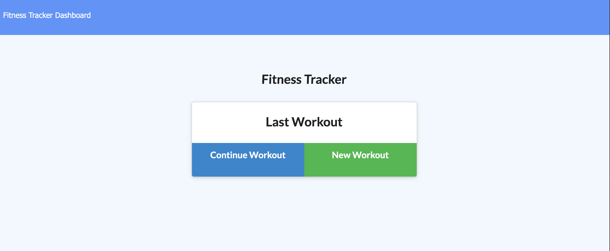
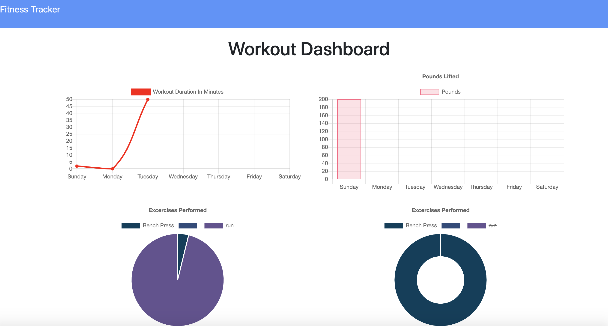
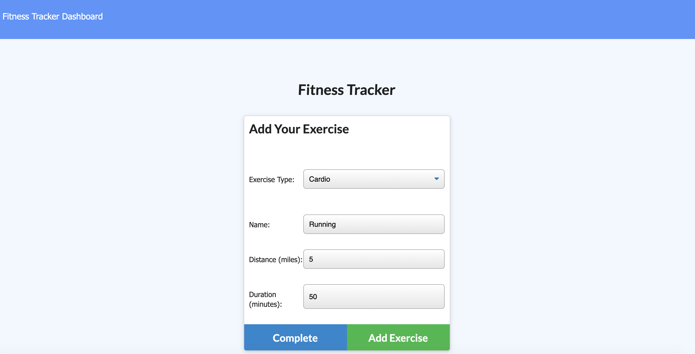

# Fitness Tracker

## Description
This is an application that can be used to create, view and update a database with different exercises, reps and durations.

 

## Table of Contents 
* [Installation](#installation)
* [Usage](#usage)
* [Credits](#credits)
* [MIT License](#MIT-License)
* [Contributing](#Contributing)

## Installation
No installation required.  You can just visit the deployed application here:

## Usage 
You can use this app to store, view and modify your workouts.

## Test Instructions

No tests at the moment.

## MIT License

This project is licensed under the MIT license.

## Contributing

No collaborators at this time but you are more than welcome to improve it!

## Questions

If you have any questions pleae direct them to my email address: diegocordoba87@gmail.com or contact me via GitHub here: 
https://github.com/diegocordoba87
 

